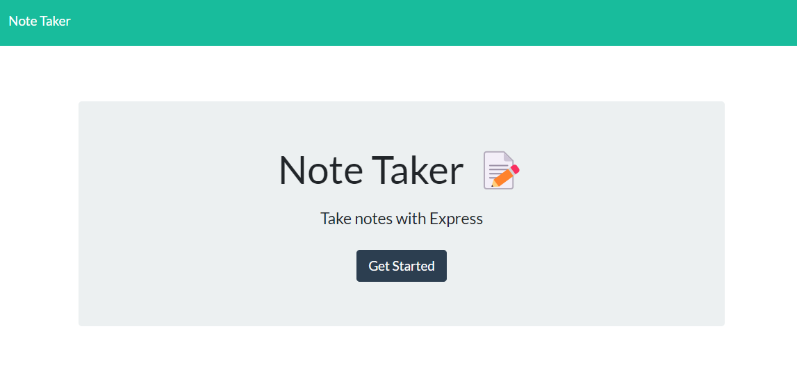
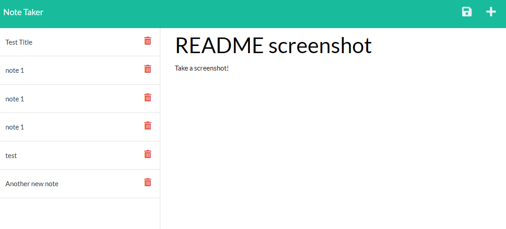

# Note Taker	

## Description 
The goal of this project was to create a note taking application. Notes can be added, saved, and deleted. 

Technologies used: HTML, CSS, JavaScript, Node.js, Express.js, Heroku

## Site Images

To visit the site click [here](TBA). 

## License
Please refer to the license in the repo. 